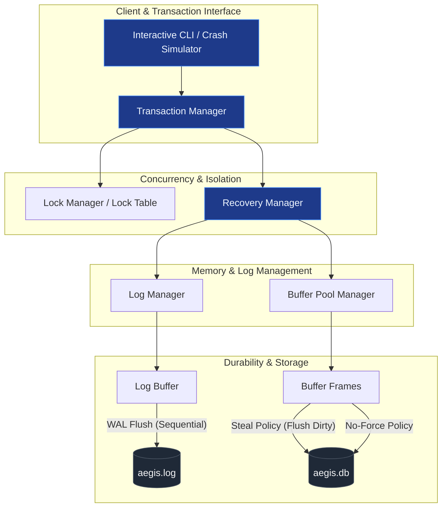

# 🛡️ AegisDB

AegisDB (*Aegis* = Protection) is an advanced, educational **Self-Recovery Database Engine** designed to demonstrate transaction durability, write-ahead logging (WAL), and the classical **ARIES (Algorithms for Recovery and Isolation Exploiting Semantics)** crash-recovery algorithm.

By implementing a **Steal/No-Force** memory management policy, AegisDB simulates realistic system failures (crashes, power loss, process termination) and automatically recovers to a consistent, transactionally sound state upon reboot.

---

## 🏗️ System Architecture

AegisDB is divided into modular subsystems to isolate storage, buffer management, concurrency control, and recovery logic.



### Subsystems Breakdown

1. **Storage Manager**:
   - Manages physical file structures (`aegis.db`).
   - Serializes/deserializes database pages (standard 4KB frames).
   - Directs low-level I/O operations.

2. **Buffer Pool Manager (BPM)**:
   - Maintains a set of in-memory page frames.
   - Implements page replacement policies (e.g., Clock or LRU).
   - Enforces a **Steal / No-Force** policy:
     - **Steal**: Pages modified by uncommitted transactions can be written (stolen) to disk. *Necessitates Undo logging.*
     - **No-Force**: Pages modified by committed transactions do not need to be flushed immediately to disk. *Necessitates Redo logging.*

3. **Transaction Manager (TM)**:
   - Tracks active transactions and coordinates their lifecycles (`BEGIN`, `COMMIT`, `ABORT`).
   - Integrates with the **Lock Manager** to maintain Strict Two-Phase Locking (SS2PL) for serializability.

4. **Log Manager (LM)**:
   - Appends log records to an in-memory sequential **Log Buffer**.
   - Assigns monotonically increasing **Log Sequence Numbers (LSNs)**.
   - Enforces the **Write-Ahead Logging (WAL)** protocol: flushes the Log Buffer to `aegis.log` *before* the dirty pages are written to the database file.

5. **Recovery Manager (RM)**:
   - Analyzes logs, performs periodic checkpointing, and runs the recovery engine upon reboot.

---

## ⚡ The ARIES Recovery Protocol

AegisDB implements the **ARIES** algorithm, which runs in three distinct phases during system startup after an ungraceful shutdown.

```mermaid
sequenceDiagram
    participant Log as Log File (aegis.log)
    participant RM as Recovery Manager
    participant State as Database State (aegis.db)

    Note over RM: System Startup (Crash Detected)
    
    rect rgb(30, 41, 59)
        Note over RM: Phase 1: Analysis
        RM->>Log: Scan forward from last Checkpoint
        Note over RM: Reconstructs Transaction Table & Dirty Page Table (DPT)
    end

    rect rgb(17, 94, 89)
        Note over RM: Phase 2: Redo ("Repeat History")
        RM->>Log: Scan forward from minimum RecLSN in DPT
        Log->>State: Reapply page updates (both committed and active)
        Note over State: Re-establishes exact pre-crash memory state
    end

    rect rgb(153, 27, 27)
        Note over RM: Phase 3: Undo ("Rollback Losers")
        RM->>Log: Scan backward from end of Log
        Log->>State: Reverse actions of active (loser) transactions
        RM->>Log: Write Compensation Log Records (CLRs) for undone actions
        Note over State: Re-establishes database consistency
    end
```



### 1. Analysis Phase
- Scans the log **forward** from the last known checkpoint record.
- Identifies all transactions that were active at the time of the crash (added to the **Transaction Table**).
- Identifies all pages that were dirty in-memory but not yet written to disk (added to the **Dirty Page Table** with their `RecLSN` — the oldest log record that dirtied the page).

### 2. Redo Phase ("Repeating History")
- Scans the log **forward** starting from the minimum `RecLSN` in the Dirty Page Table.
- Re-executes the operations of *all* transactions (including uncommitted "loser" transactions and committed "winner" transactions) to restore the database state to the exact moment of the crash.
- Employs the `PageLSN` (stored on each database page) to avoid redundant page writes if the disk copy is already up-to-date.

### 3. Undo Phase ("Rolling Back Losers")
- Scans the log **backward** from the end of the log file.
- Reverses the modifications of all transactions identified as active (losers) during the Analysis phase.
- Writes **Compensation Log Records (CLRs)** to the log file for every reversed operation. This guarantees that if the system crashes *during* recovery, the recovery process does not repeatedly undo already-reversed updates.

---

## 📂 Data structures & Format

### Log Record Layout
Each entry in `aegis.log` is serialized in the following binary or structured format:

| Field | Type | Description |
| :--- | :--- | :--- |
| `LSN` | 64-bit Int | Unique, sequential ID of this log record. |
| `PrevLSN` | 64-bit Int | LSN of the previous log record written by this transaction (backlink). |
| `TxID` | 32-bit Int | Unique identifier of the transaction. |
| `Type` | Enum | `BEGIN`, `COMMIT`, `ABORT`, `UPDATE`, `CLR`, `CHECKPOINT`. |
| `PageID` | 32-bit Int | The database page target (for `UPDATE` / `CLR`). |
| `Offset` | 16-bit Int | Offset within the page where modification occurred. |
| `BeforeImage`| Bytes | Old data bytes (used for UNDO). |
| `AfterImage` | Bytes | New data bytes (used for REDO). |
| `UndoNextLSN`| 64-bit Int | Only for CLR: Points to the next LSN to be undone for the transaction. |

### Page Header Layout
Database pages (4KB) reserve a small metadata section at the beginning:
- `PageLSN`: The LSN of the log record corresponding to the most recent update to this page.
- `PageID`: Unique identifier of the page.
- `FreeSpacePointer`: Offset pointing to the start of free space on the page.

---

## 📅 Project Roadmap

AegisDB's implementation plan is divided into four milestones:

### 🔹 Phase 1: Storage Layer & Page Buffer
- Implement a Page Serialization Engine (binary representation of pages).
- Build the disk manager to read/write pages.
- Implement the `BufferPoolManager` with a Steal/No-Force policy and replacement strategy.

### 🔹 Phase 2: Transaction Logging
- Define the structured binary representation of Log Records.
- Develop the `LogManager` with an asynchronous log buffer.
- Establish the Write-Ahead Logging (WAL) constraint during page eviction in `BufferPoolManager`.

### 🔹 Phase 3: ARIES Recovery Engine
- Build the Checkpoint generator (writing fuzzy checkpoints containing Transaction Table and DPT).
- Implement the recovery parser for `aegis.log`.
- Develop the Analysis, Redo, and Undo passes of ARIES.
- Add support for CLRs (Compensation Log Records) during rollback.

### 🔹 Phase 4: Crash Simulator & Verification Suite
- Build a CLI client to perform concurrent transactions.
- Create a crash simulation engine that abruptly kills the database process during load.
- Develop automated verification scripts to assert that the recovered state matches serializable, committed transactions and lacks any uncommitted modifications.

---

## 🛠️ Getting Started (Planned Usage)

Once the core files are generated:

1. **Install dependencies** (depending on target implementation language):
   ```bash
   # If implemented in Python:
   pip install -r requirements.txt
   ```

2. **Run Interactive Crash Simulator**:
   ```bash
   python -m aegisdb.simulator --transactions 50 --crash-interval 1.5s
   ```

3. **Verify Database Consistency**:
   ```bash
   python -m aegisdb.verify --db aegis.db --log aegis.log
   ```

---

## 📜 References & Further Reading
- *Database System Concepts (7th Edition)* — Silberschatz, Korth, Sudarshan (Chapter 19: Recovery System)
- *ARIES: A Transaction Recovery Method Supporting Fine-Granularity Locking and Partial Rollbacks Using Write-Ahead Logging* — C. Mohan, et al. (ACM TODS, 1992)
- *Database Management Systems (3rd Edition)* — Raghu Ramakrishnan and Johannes Gehrke (Chapter 18: Crash Recovery)
