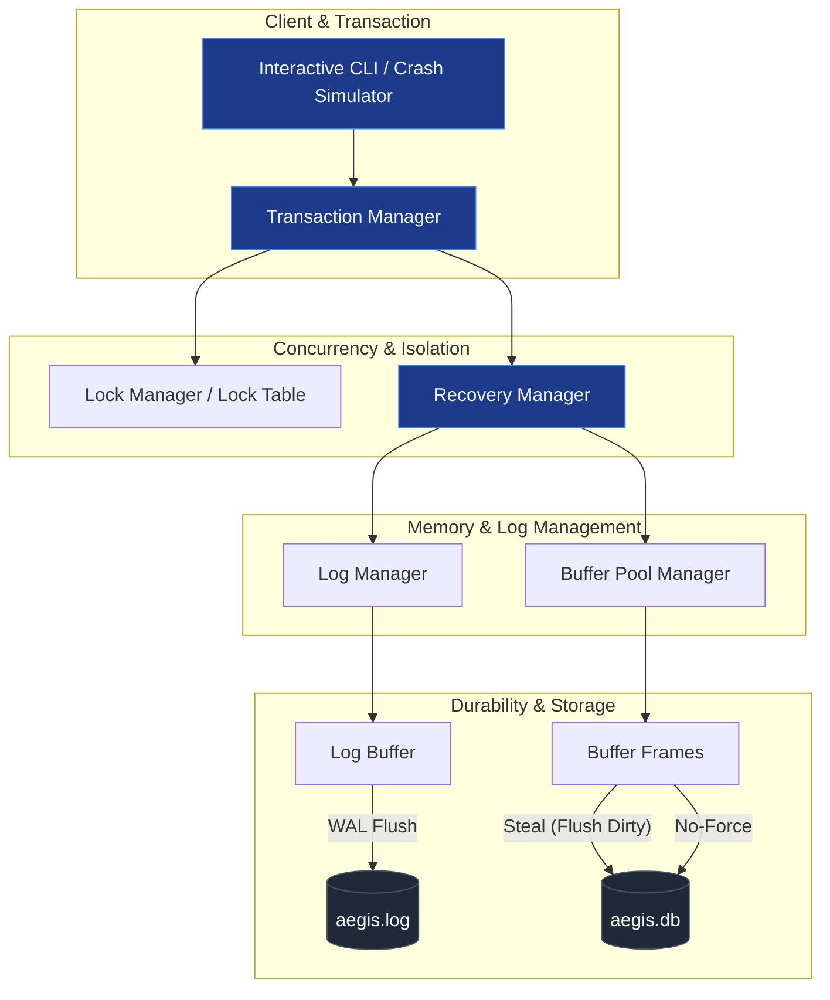

# 🛡️ AegisDB

AegisDB (*Aegis* = Protection) is an educational, self-recovering database engine built to demonstrate transaction durability, write-ahead logging (WAL), and the classical **ARIES** recovery algorithm.

Using a **Steal/No-Force** memory policy, AegisDB simulates unexpected process crashes or power losses and automatically restores itself to a transactionally consistent state upon reboot.

---

## 🏗️ System Architecture

AegisDB uses modular subsystems to isolate storage, buffer management, concurrency, and recovery logic.



### Core Subsystems

*   **Storage Manager**: Manages reading/writing of physical 4KB database pages to `aegis.db`.
*   **Buffer Pool Manager (BPM)**: Handles in-memory page frames using a **Steal/No-Force** policy:
    *   *Steal*: Uncommitted pages can be written to disk early (requiring *Undo*).
    *   *No-Force*: Committed pages do not need to be written to disk immediately (requiring *Redo*).
*   **Transaction Manager (TM)**: Manages transaction lifecycles (`BEGIN`, `COMMIT`, `ABORT`) with Strict 2-Phase Locking (SS2PL) for serializability.
*   **Log Manager (LM)**: Appends sequential log records to an in-memory buffer, enforcing the **Write-Ahead Logging (WAL)** protocol.
*   **Recovery Manager (RM)**: Implements the ARIES recovery process upon reboot.

---

## ⚡ The ARIES Recovery Protocol

When AegisDB detects an ungraceful shutdown, the **Recovery Manager** executes ARIES in three phases:

```mermaid
sequenceDiagram
    participant Log as Log File (aegis.log)
    participant RM as Recovery Manager
    participant State as Database State (aegis.db)

    Note over RM: System Startup (Crash Detected)
    
    rect rgb(30, 41, 59)
        Note over RM: Phase 1: Analysis
        RM->>Log: Scan forward from last Checkpoint
        Note over RM: Reconstructs active transactions & dirty pages
    end

    rect rgb(17, 94, 89)
        Note over RM: Phase 2: Redo ("Repeat History")
        RM->>Log: Scan forward from oldest dirty page (RecLSN)
        Log->>State: Reapply updates (both committed and uncommitted)
    end

    rect rgb(153, 27, 27)
        Note over RM: Phase 3: Undo ("Rollback Losers")
        RM->>Log: Scan backward to reverse uncommitted transactions
        RM->>Log: Write Compensation Log Records (CLRs)
        Note over State: Database returns to a consistent state
    end
```



1.  **Analysis Phase**: Scans the log forward from the last checkpoint to identify active transaction "losers" and in-memory dirty pages at the time of the crash.
2.  **Redo Phase**: Scans forward from the oldest dirty page to re-apply all operations, restoring the database to its exact pre-crash state.
3.  **Undo Phase**: Scans backward to reverse modifications made by uncommitted (loser) transactions, writing **Compensation Log Records (CLRs)** to ensure recovery is idempotent.

---

## 📅 Roadmap & Progress

- [x] **Phase 1: Storage Layer & Page Buffer** (Page binary serialization, Direct I/O via `os.fsync`, LRU Buffer Pool Manager)
- [x] **Phase 2: Write-Ahead Logging** (36-byte binary log headers, LogManager, Steal/No-Force WAL constraint)
- [x] **Phase 3: ARIES Recovery Engine** (Log indexer, Analysis/Redo/Undo passes, CLRs)
- [x] **Phase 4: Crash Simulator & Verification** (Python `multiprocessing` process-kill simulator, ARIES state verification script)

---

## 🚀 Getting Started

Detailed specifications, including binary log layouts, page formats, and language ecosystem evaluations (Python, Go, Rust), are documented in [docs.md](file:///c:/Users/Asus/Desktop/New folder/Projects/AegisDB/docs.md).

### Basic CLI Commands (Implemented)

```bash
# Start the transaction workload & crash simulator
python -m aegisdb.simulator --transactions 500 --crash-interval 1.5

# Verify post-crash recovery consistency using ARIES
python -m aegisdb.verify --db aegis.db --log aegis.log
```
